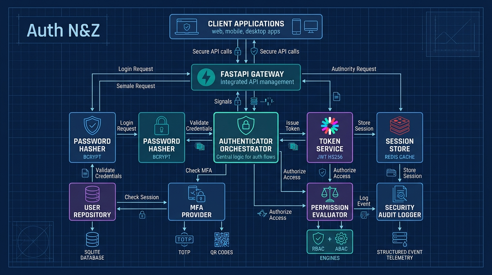
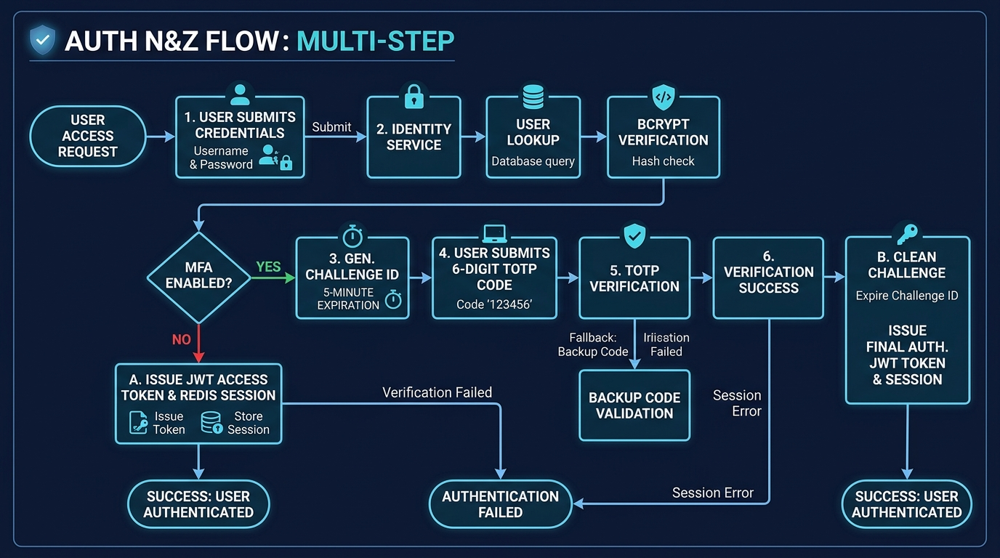
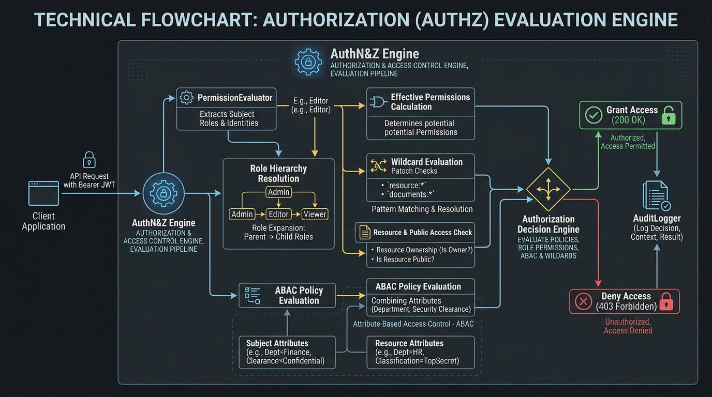

# Auth N&Z - Enterprise Authentication and Authorization System

Auth N&Z is a modular, high-security Python Identity and Access Management (IAM) framework designed for distributed architectures, microservices, and standalone mini-servers.

---

## System Architecture



The system strictly adheres to the principle of Separation of Concerns, dividing security responsibilities into distinct computational and storage layers:

1. **Password Hasher (`password_hasher.py`)**
   - Implements salted Bcrypt hashing (cost factor 12).
   - Provides transparent rehashing detection (`needs_rehash`) for seamless algorithmic migration.
   - Constant-time verification against timing side-channel attacks.

2. **User Repository (`user_repository.py`)**
   - SQLite persistent storage engine (`DATABASE.db`).
   - Case-insensitive, normalized identifier resolution.
   - Dynamic partial updates, soft deactivation (`is_active = 0`), and hard deletion.
   - JSON-encoded extensible roles and metadata support.

3. **Token Service (`token_service.py`)**
   - Stateless cryptographic JWT generation and verification (`HS256`).
   - Enforces registered claims: `sub`, `iat`, `exp`, `jti`, and `type` (`access` vs. `refresh`).
   - Secure key persistence via `.env` file generation and loading.
   - Token revocation blocklist mechanism.

4. **Session Store (`session_store.py`)**
   - Stateful in-memory session management powered by Redis hashes.
   - Sliding TTL expiration with `refresh_session_ttl`.
   - Secondary user index (`user_sessions:{user_id}`) for single-operation revocation across all devices.

5. **Multi-Factor Authentication Provider (`mfa_provider.py`)**
   - RFC 6238 Time-based One-Time Password (TOTP) standard.
   - 160-bit Base32 secret generation and `otpauth://totp/` provisioning URIs.
   - Dynamic time step window tolerance to accommodate client clock drift.
   - Ambiguity-free Base58 emergency recovery backup codes with single-use consumption semantics.

6. **Authenticator Orchestrator (`authenticator.py`)**
   - Central coordinator orchestrating multi-factor challenge-response workflows.
   - Primary credential verification, user enumeration protection, and temporary MFA challenge session tracking.
   - Bearer token sanitization and Redis session resolution.

7. **Permission Evaluator (`permission_evaluator.py`)**
   - Role-Based Access Control (RBAC) with recursive role hierarchy inheritance (`admin > editor > viewer`).
   - Wildcard permission evaluation (global `*` and domain-scoped `documents:*`).
   - Multi-layer resource access evaluation (Role bypass, Ownership matching, Public read-only access).
   - Attribute-Based Access Control (ABAC) multi-condition policy engine.

8. **Audit Logger (`audit_logger.py`)**
   - Structured, tamper-evident security telemetry.
   - Records authentication successes, failure forensics, access denials (403), and administrative events.
   - Parameterized, SQL-injection safe historical querying with reverse-chronological pagination.

9. **HTTP Gateway Server (`server.py`)**
   - Production-ready FastAPI REST API service.
   - Interactive OpenAPI / Swagger UI at `/docs`.
   - Dependency-injected Bearer token resolution and CORS middleware.

---

## Multi-Step Authentication Workflow



### Authentication Sequence
1. **Primary Credential Verification:** The user submits their identifier and plain password. The Authenticator validates the record and verifies the Bcrypt hash.
2. **MFA Challenge Check:** If MFA is enabled on the account, a temporary 5-minute challenge identifier is generated and returned to the client (`MFA_REQUIRED`).
3. **Second-Factor Verification:** The client submits the 6-digit TOTP code (or an emergency single-use backup code). Upon verification, the temporary challenge is invalidated, and the user receives their access token and session ID.

---

## Authorization and Policy Evaluation Workflow



### Policy Evaluation Pipeline
1. **Role Expansion:** Directly assigned roles are recursively expanded through the defined role hierarchy (`admin > editor > viewer`).
2. **Permission Compilation:** Flattened distinct permission strings are compiled for all effective roles.
3. **Wildcard & Prefix Matching:** The required permission is verified against exact matches, global wildcards (`*`), and domain prefixes (`documents:*`).
4. **Fine-Grained ABAC & Ownership:** Evaluates contextual attributes such as resource owner ID, department isolation, security clearance levels, and environmental conditions.

---

## Getting Started

### Prerequisites
- Python 3.10+
- (Optional) Redis server for stateful session persistence

### Installation

1. Clone or navigate to the project directory:
   ```bash
   git clone https://github.com/L4S3r/AuthN-Z
   cd "Auth N&Z"
   ```

2. Install required dependencies:
   ```bash
   pip install -r requirements.txt
   ```

3. Run the interactive demonstration test runner:
   ```bash
   python main.py
   ```

4. Launch the HTTP REST API server:
   ```bash
   uvicorn server:app --host 0.0.0.0 --port 8000 --reload
   ```

5. Open your web browser to explore and test endpoints via Swagger UI:
   ```text
   http://localhost:8000/docs
   ```

---

## API Reference

### Authentication Endpoints
- `POST /auth/register` - Create account with username, email, password, and roles.
- `POST /auth/login` - Authenticate credentials. Returns tokens or an active MFA challenge.
- `POST /auth/mfa/setup` - Generate TOTP QR secret and emergency backup codes (Protected).
- `POST /auth/mfa/complete` - Submit 6-digit TOTP code or backup code to finalize challenge.
- `GET /auth/me` - Retrieve current user profile and JWT claim context (Protected).

### Resource and Policy Endpoints
- `GET /documents/{doc_id}` - Access controlled resource evaluated by RBAC and ABAC policies.
- `GET /audit/logs` - Query security telemetry audit trail (Requires Admin role).

---

## Security Guarantees

- **Zero Plaintext Storage:** Passwords hashed with salted Bcrypt; backup recovery codes stored as SHA-256 digests.
- **Timing Attack Mitigation:** Constant-time comparisons (`hmac.compare_digest`, `bcrypt.checkpw`).
- **Cryptographic Randomness:** System entropy sourced via Python `secrets` module.
- **Strict Default-Deny:** Unmatched authorization policies and unauthenticated routes default to denial.
- **Replay Protection:** Unique single-use challenge identifiers and consumable recovery codes.
